# Introdução

Informações básicas do projeto.

* **Projeto:** [Innertrip]
* **Repositório GitHub:** [[LINK PARA O REPOSITÓRIO NO GITHUB](https://github.com/ICEI-PUC-Minas-PMGES-TI/pmg-es-2026-1-ti1-0438100-innertrip-2/)]
* **Membros da equipe:**

  * [Vítor Augusto de Souza](https://github.com/Vitor-vas) 
  * [Arthur Moreira Figueiredo](https://github.com/arthurmoreira-dev)
  * [João Vitor Portes Rocha Soares](https://github.com/JoaoPortess) 
  * [Pedro Henrique Nascimento Cézar](https://github.com/pedrohcezar) 
  * [Lucas Gonçalves Pimenta Silva]() ⚠️ Alterar ⚠️

A documentação do projeto é estruturada da seguinte forma:

1. Introdução
2. Contexto
3. Product Discovery
4. Product Design
5. Metodologia
6. Solução
7. Referências Bibliográficas

✅ [Documentação de Design Thinking (MIRO)](files/processo-dt.pdf)

# Contexto

, o objetivo do nosso projeto é ajudar essas pessoas oferecendo uma plataforma que une principalmente alunos de psicologia
e essas pessoas, oferecendo um serviço de qualidade e gratuito para as pessoas que precisam e para os alunos iremos oferecer horas complementares necessárias para a formação no curso. 

## Problema

**✳️✳️✳️ O Brasil tem cerca de 152 milhões de pessoas sem plano de saúde. Para a maioria delas, o acesso a
atendimento psicológico e psiquiátrico é praticamente inexistente: consultas particulares custam entre R$
150 e R$ 350, filas no SUS podem levar meses, e o estigma social ainda afasta quem mais precisa de
buscar ajuda.
Ao mesmo tempo, milhares de estudantes de Psicologia e Medicina precisam cumprir horas de
estágio supervisionado e têm dificuldade de encontrar contextos reais de prática. Profissionais formados
que gostariam de fazer trabalho voluntário não têm um canal estruturado para isso.  ✳️✳️✳️**

> ⚠️ **APAGUE ESSA PARTE ANTES DE ENTREGAR SEU TRABALHO**
>
> Nesse momento você deve apresentar o problema que a sua aplicação deve resolver. No entanto, não é a hora de comentar sobre a aplicação. Descreva também o contexto em que essa aplicação será usada, se houver: empresa, tecnologias, etc. Novamente, descreva apenas o que de fato existir, pois ainda não é a hora de apresentar requisitos detalhados ou projetos.
>
> **Orientações**:
>
> - [Objetivos, Problema de pesquisa e Justificativa](https://medium.com/@versioparole/objetivos-problema-de-pesquisa-e-justificativa-c98c8233b9c3)
> - [Matriz Certezas, Suposições e Dúvidas](https://medium.com/educa%C3%A7%C3%A3o-fora-da-caixa/matriz-certezas-suposi%C3%A7%C3%B5es-e-d%C3%BAvidas-fa2263633655)
> - [Brainstorming](https://www.euax.com.br/2018/09/brainstorming/)

## Objetivos

**✳️✳️✳️ Mente Acessível é uma plataforma web que conecta, de forma direta e segura, pessoas sem acesso a
saúde mental a estudantes e profissionais dispostos a atender gratuitamente ou a preço social — tudo
online, sem deslocamento e sem custo para o usuário.
A proposta resolve três problemas simultaneamente: a pessoa vulnerável recebe atendimento real e
qualificado; o estudante ganha prática supervisionada e horas complementares; e a instituição (faculdade
ou ONG) organiza e valida tudo dentro da própria plataforma. ✳️✳️✳️**

> ⚠️ **APAGUE ESSA PARTE ANTES DE ENTREGAR SEU TRABALHO**
>
> Aqui você deve descrever os objetivos do trabalho indicando que o objetivo geral é desenvolver um software para solucionar o problema apresentado acima. Apresente também alguns (pelo menos 2) objetivos específicos dependendo de onde você vai querer concentrar a sua prática investigativa, ou como você vai aprofundar no seu trabalho.
>
> **Orientações**:
>
> - [Objetivo geral e objetivo específico: como fazer e quais verbos utilizar](https://blog.mettzer.com/diferenca-entre-objetivo-geral-e-objetivo-especifico/)

## Justificativa

**✳️✳️✳️ COLOQUE AQUI O SEU TEXTO ✳️✳️✳️**

> ⚠️ **APAGUE ESSA PARTE ANTES DE ENTREGAR SEU TRABALHO**
>
> Descreva a importância ou a motivação para trabalhar com esta aplicação que você escolheu. Indique as razões pelas quais você escolheu seus objetivos específicos ou as razões para aprofundar em certos aspectos do software.
>
> O grupo de trabalho pode fazer uso de questionários, entrevistas e dados estatísticos, que podem ser apresentados, com o objetivo de esclarecer detalhes do problema que será abordado pelo grupo.
>
> **Orientações**:
>
> - [Como montar a justificativa](https://guiadamonografia.com.br/como-montar-justificativa-do-tcc/)

## Público-Alvo

**✳️✳️✳️ 
Pessoa Vulnerável: Usuário principal. Qualquer pessoa sem acesso a plano de saúde que precise de apoio psicológico ou psiquiátrico.
Estudante:Estudante de Psicologia ou Medicina em período de estágio supervisionado.
Profissional Voluntário: Psicólogo ou psiquiatra formado que oferece horários voluntários ou a preço social.
Instituição: Faculdades, ONGs ou CAPS que supervisionam estudantes e organizam a oferta de atendimentos.
 ✳️✳️✳️**

> ⚠️ **APAGUE ESSA PARTE ANTES DE ENTREGAR SEU TRABALHO**
>
> Descreva o mercado para o qual a solução está sendo desenvolvida, detalhando um pouco mais sobre o perfil dos usuários: conhecimentos prévios, relação com a tecnologia, relações hierárquicas, etc. Adicione informações sobre o público-alvo por meio de uma descrição textual ou por meio do mapa de stakeholders, ou como o grupo achar mais conveniente.
>
> **Orientações**:
>
> - [Público-alvo: o que é, tipos, como definir seu público e exemplos](https://klickpages.com.br/blog/publico-alvo-o-que-e/)
> - [Qual a diferença entre público-alvo e persona?](https://rockcontent.com/blog/diferenca-publico-alvo-e-persona/)

# Product Discovery

## Etapa de Entendimento

**✳️✳️✳️ APRESENTE OS ARTEFATOS DA ETAPA  ✳️✳️✳️**
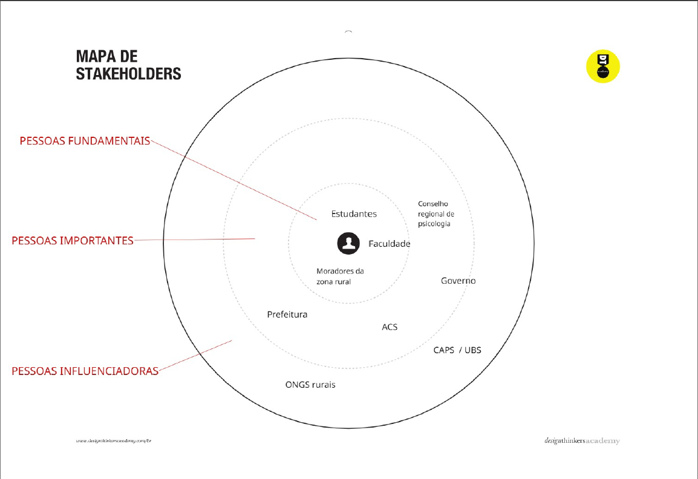
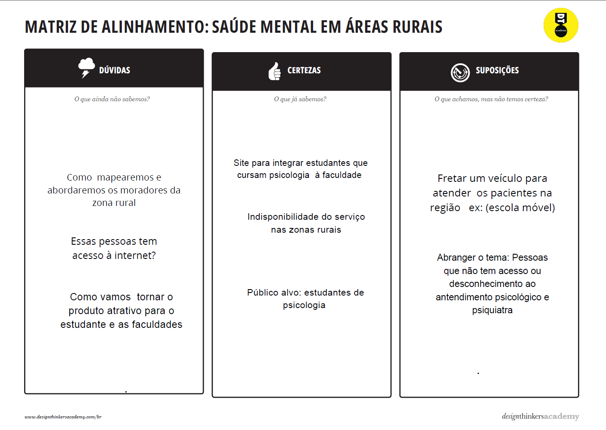

> ⚠️ **APAGUE ESSA PARTE ANTES DE ENTREGAR SEU TRABALHO**
>
> Nessa etapa, vamos trabalhar com a metdologia de Design Thinking para compreender com maior profundidade o problema a ser tratado. Nesse processo, vamos elaborar:
>
> * **Matriz CSD**: também conhecida por Matriz de Alinhamento, é uma ferramenta utilizada no Design Thinking para organizar informações e facilitar o processo de tomada de decisão e solução de problemas;
> * **Mapa de stakeholders**: ferramenta que nos permite compreender o grupo de pessoas e entidades que devemos estudar e conversar para entender mais sobre o problema
> * **Entrevistas qualitativas**: série de entrevistas qualitativas para validar suposições e solucionar as dúvidas com as principais pessoas envolvidas;
> * **Highlights de pesquisa**: um compilado do levantamento realizado por meio das entrevistas.

## Etapa de Definição

### Personas

**✳️✳️✳️ APRESENTE OS DIAGRAMAS DE PERSONAS ✳️✳️✳️**

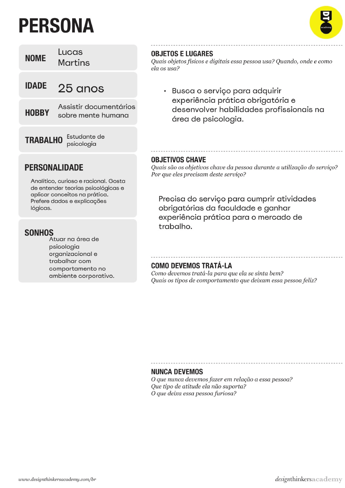
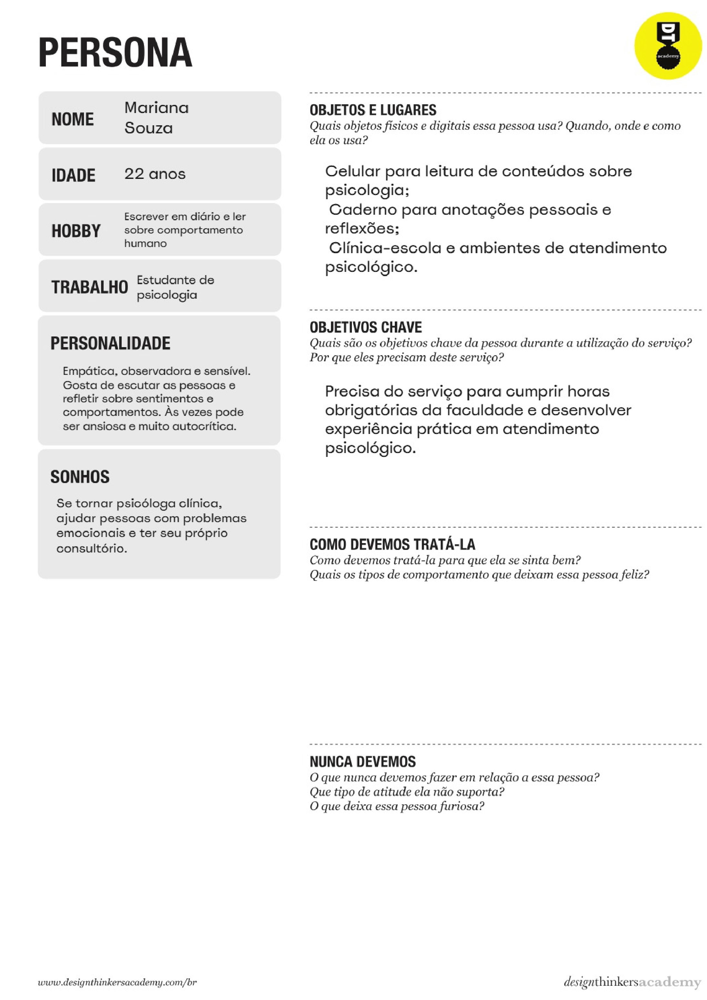
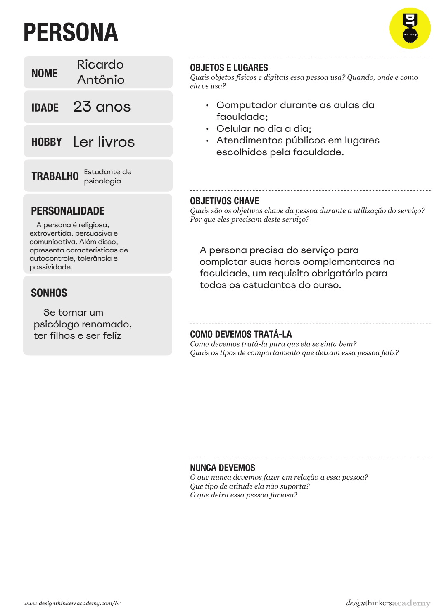

> ⚠️ **APAGUE ESSA PARTE ANTES DE ENTREGAR SEU TRABALHO**
>
> Relacione as personas identificadas no seu projeto e os respectivos mapas de empatia. Lembre-se que você deve ser enumerar e descrever precisamente e de forma personalizada todos os principais envolvidos com a solução almeja.
>
> **Orientações**:
>
> - [Persona x Público-alvo](https://flammo.com.br/blog/persona-e-publico-alvo-qual-a-diferenca/)
> - [O que é persona?](https://resultadosdigitais.com.br/blog/persona-o-que-e/)
> - [Rock Content](https://rockcontent.com/blog/personas/)
> - [Criar personas (Hotmart)](https://blog.hotmart.com/pt-br/como-criar-persona-negocio/)

# Product Design

Nesse momento, vamos transformar os insights e validações obtidos em soluções tangíveis e utilizáveis. Essa fase envolve a definição de uma proposta de valor, detalhando a prioridade de cada ideia e a consequente criação de wireframes, mockups e protótipos de alta fidelidade, que detalham a interface e a experiência do usuário.

## Histórias de Usuários

Com base na análise das personas foram identificadas as seguintes histórias de usuários:

| EU COMO...`PERSONA`                     | QUERO/PRECISO ...`FUNCIONALIDADE`                                                       | PARA ...`MOTIVO/VALOR`                         |
| ---------------------  | -------------------------------------------------------------------------- | ---------------------------------------------------------------------------------------------------------- |
| Estudante de Psicologia| Cadastrar meus horários e minha área de atuação.                           | Ser encontrado por pessoas que precisam de ajuda e acumular horas de estágio reconhecidas pela instituição.|
| Estudante de Psicologia| Acompanhar meu histórico acumulado.                                        | Que minha instituição valide as horas de estágio de forma automática, sem burocracia extra. |

| Pessoa em situação de vulnerabilidade| Encontrar um psicólogo ou estudante supervisionado disponível para me atender gratuitamente| Conseguir apoio profissional qualificado sem me preocupar com o custo da consulta|
| Pessoa em situação de vulnerabilidade| visualizar os horários disponíveis dos profissionais e escolher um                         | garantir meu atendimento de forma simples|


> ⚠️ **APAGUE ESSA PARTE ANTES DE ENTREGAR SEU TRABALHO**
>
> Apresente aqui as histórias de usuário que são relevantes para o projeto de sua solução. As Histórias de Usuário consistem em uma ferramenta poderosa para a compreensão das necessidades de cada persona. Se possível, agrupe as histórias de usuário por contexto, para facilitar consultas recorrentes à essa parte do documento.
>
> **Orientações**:
>
> - [Histórias de usuários com exemplos e template](https://www.atlassian.com/br/agile/project-management/user-stories)
> - [Como escrever boas histórias de usuário (User Stories)](https://medium.com/vertice/como-escrever-boas-users-stories-hist%C3%B3rias-de-usu%C3%A1rios-b29c75043fac)

## Proposta de Valor

**✳️✳️✳️ APRESENTE O DIAGRAMA DA PROPOSTA DE VALOR PARA CADA PERSONA ✳️✳️✳️**

##### Proposta de valor Geral

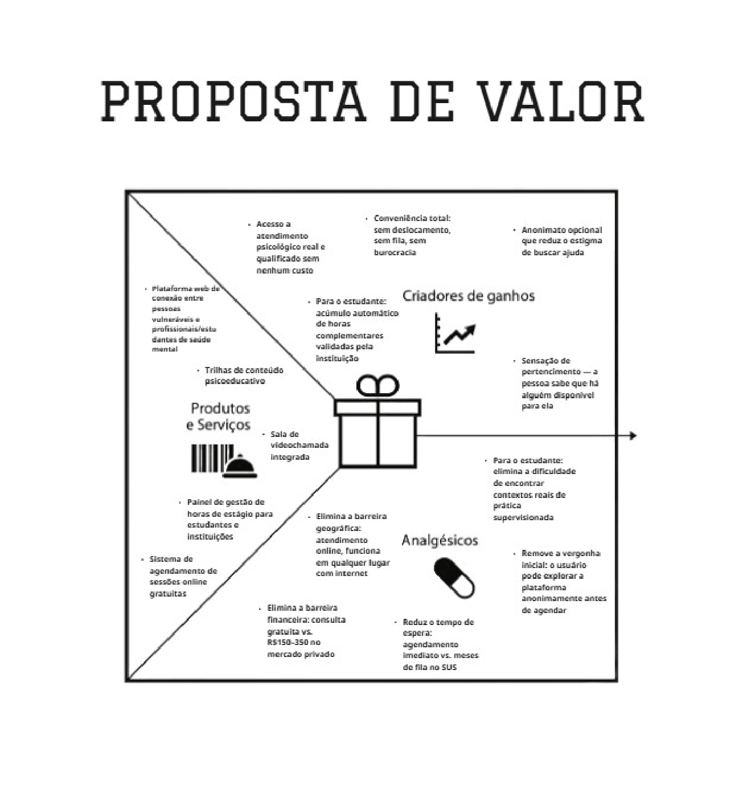

> ⚠️ **APAGUE ESSA PARTE ANTES DE ENTREGAR SEU TRABALHO**
>
> O mapa da proposta de valor é uma ferramenta que nos ajuda a definir qual tipo de produto ou serviço melhor atende às personas definidas anteriormente.

## Requisitos

As tabelas que se seguem apresentam os requisitos funcionais e não funcionais que detalham o escopo do projeto.

### Requisitos Funcionais

| ID     | Descrição do Requisito                                   | Prioridade |
| ------ | ---------------------------------------------------------- | ---------- |
| RF-001 | Permitir que o usuário procure por profissionais por diferentes filtros     | ALTA       |
| RF-002 | Permitir que o usuário agende sessões com um profissional                   | MÉDIA     |
| RF-003 | Permitir que o psicólogo/aluno acesse suas informações com tempo de trabalho| MÉDIA     |
| RF-004 | Permitir que o usuário consiga avaliar as consultas                         | MÉDIA     |
| RF-005 | Permitir que o usuário possa ver sua evolução                               | MÉDIA     |

### Requisitos não Funcionais

| ID      | Descrição do Requisito                                                              | Prioridade |
| ------- | ------------------------------------------------------------------------------------- | ---------- |
| RNF-001 | O sistema deve ter uma ux/ui que remete a calma em função da saúde mental     | MÉDIA     |

> ⚠️ **APAGUE ESSA PARTE ANTES DE ENTREGAR SEU TRABALHO**
>
> Os requisitos de um projeto são classificados em dois grupos:
>
> - [Requisitos Funcionais (RF)](https://pt.wikipedia.org/wiki/Requisito_funcional):
>   correspondem a uma funcionalidade que deve estar presente na plataforma (ex: cadastro de usuário).
> - [Requisitos Não Funcionais (RNF)](https://pt.wikipedia.org/wiki/Requisito_n%C3%A3o_funcional):
>   correspondem a uma característica técnica, seja de usabilidade, desempenho, confiabilidade, segurança ou outro (ex: suporte a dispositivos iOS e Android).
>
> Lembre-se que cada requisito deve corresponder à uma e somente uma característica alvo da sua solução. Além disso, certifique-se de que todos os aspectos capturados nas Histórias de Usuário foram cobertos.
>
> **Orientações**:
>
> - [O que são Requisitos Funcionais e Requisitos Não Funcionais?](https://codificar.com.br/requisitos-funcionais-nao-funcionais/)
> - [O que são requisitos funcionais e requisitos não funcionais?](https://analisederequisitos.com.br/requisitos-funcionais-e-requisitos-nao-funcionais-o-que-sao/)

## Projeto de Interface

Artefatos relacionados com a interface e a interacão do usuário na proposta de solução.

### Wireframes

Estes são os protótipos de telas do sistema.

**✳️✳️✳️ COLOQUE AQUI OS PROTÓTIPOS DE TELAS COM TÍTULO E DESCRIÇÃO ✳️✳️✳️**

##### TELA XPTO ⚠️ EXEMPLO ⚠️

Descrição para a tela XPTO

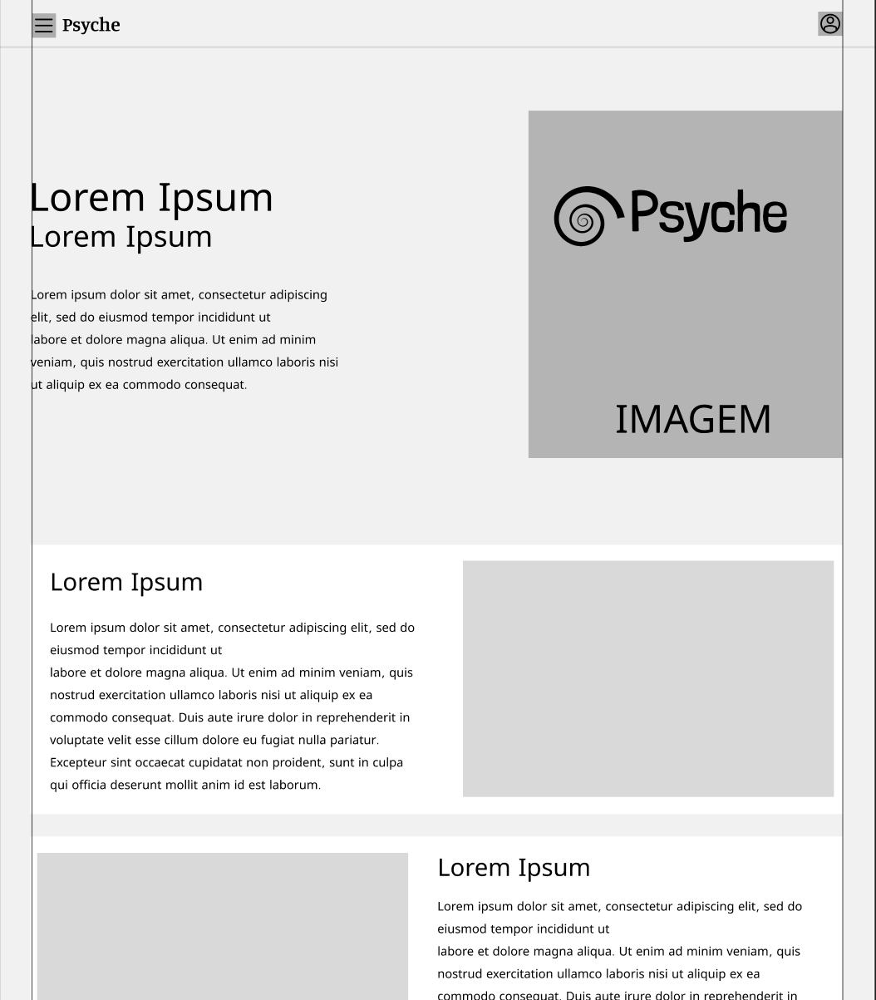
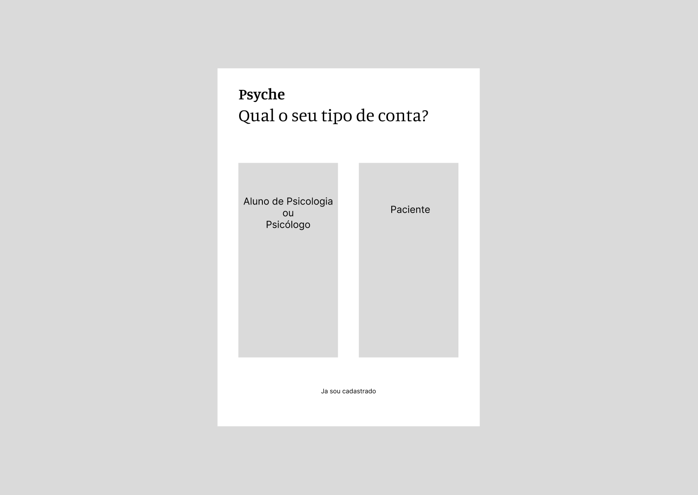
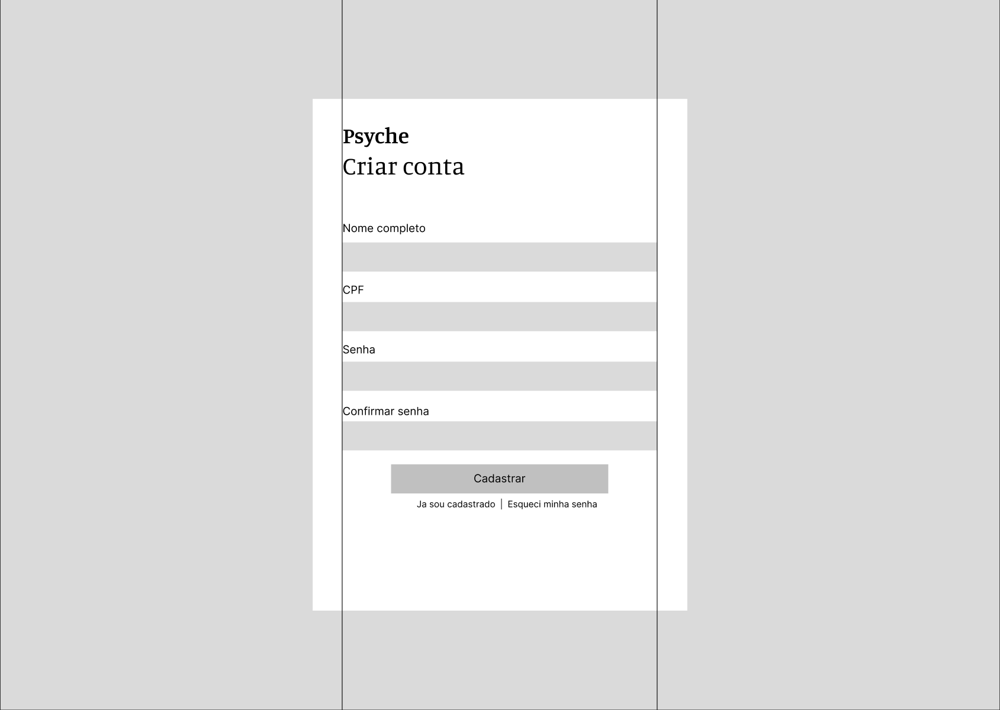
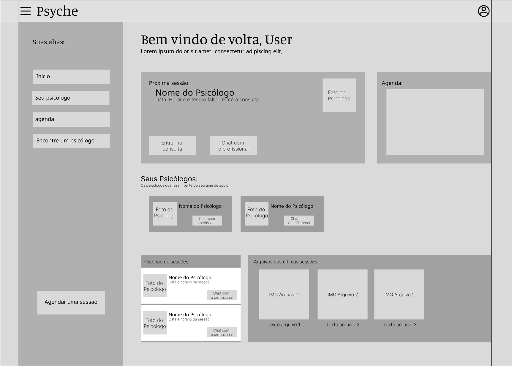
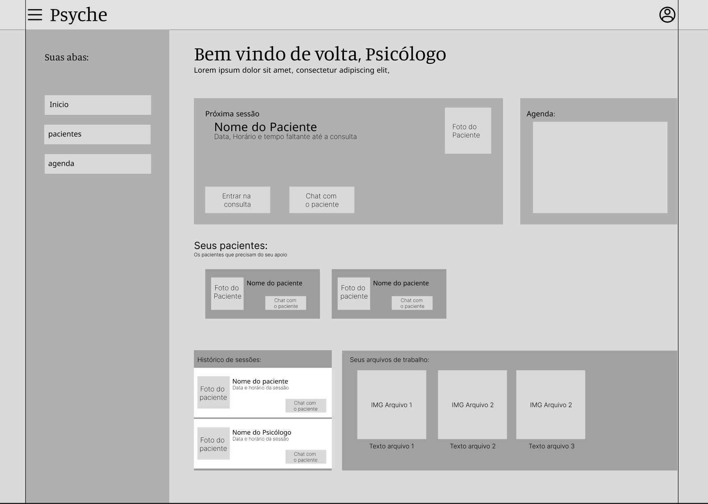
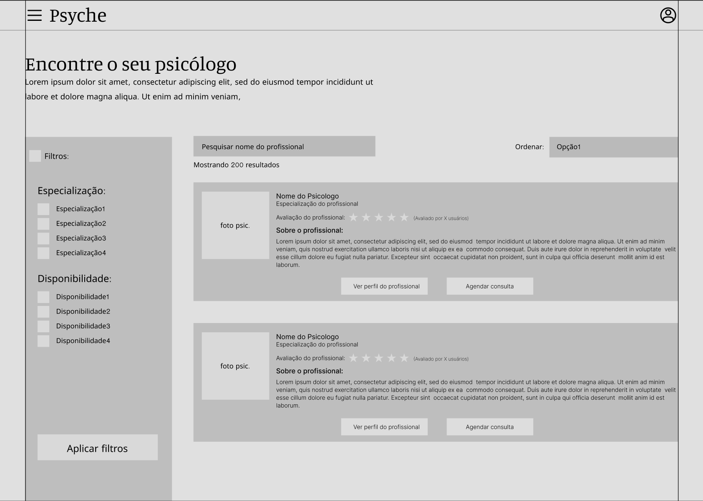

> ⚠️ **APAGUE ESSA PARTE ANTES DE ENTREGAR SEU TRABALHO**
>
> Wireframes são protótipos das telas da aplicação usados em design de interface para sugerir a estrutura de um site web e seu relacionamentos entre suas páginas. Um wireframe web é uma ilustração semelhante ao layout de elementos fundamentais na interface.
>
> **Orientações**:
>
> - [Ferramentas de Wireframes](https://rockcontent.com/blog/wireframes/)
> - [Figma](https://www.figma.com/)
> - [Adobe XD](https://www.adobe.com/br/products/xd.html#scroll)
> - [MarvelApp](https://marvelapp.com/developers/documentation/tutorials/)

### User Flow

**✳️✳️✳️ COLOQUE AQUI O DIAGRAMA DE FLUXO DE TELAS ✳️✳️✳️**

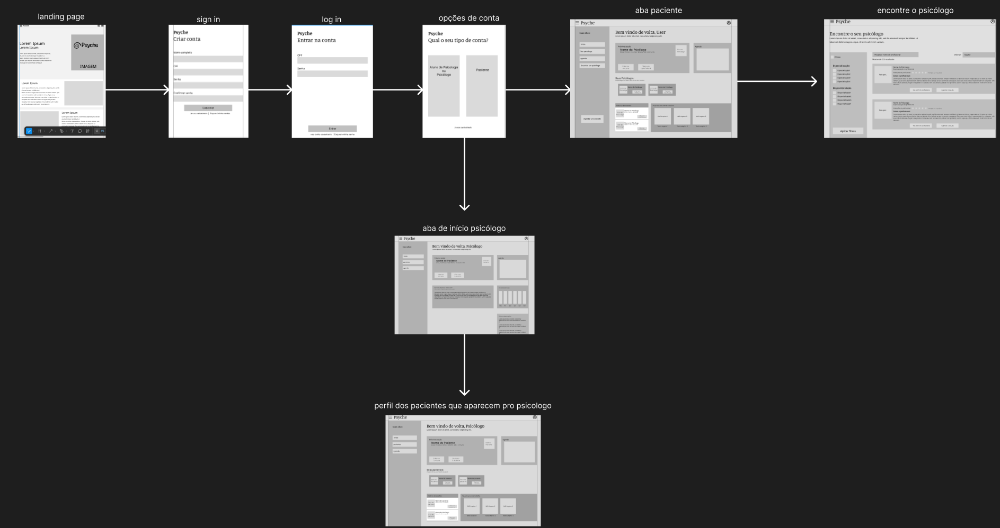

> ⚠️ **APAGUE ESSA PARTE ANTES DE ENTREGAR SEU TRABALHO**
>
> Fluxo de usuário (User Flow) é uma técnica que permite ao desenvolvedor mapear todo fluxo de telas do site ou app. Essa técnica funciona para alinhar os caminhos e as possíveis ações que o usuário pode fazer junto com os membros de sua equipe.
>
> **Orientações**:
>
> - [User Flow: O Quê É e Como Fazer?](https://medium.com/7bits/fluxo-de-usu%C3%A1rio-user-flow-o-que-%C3%A9-como-fazer-79d965872534)
> - [User Flow vs Site Maps](http://designr.com.br/sitemap-e-user-flow-quais-as-diferencas-e-quando-usar-cada-um/)
> - [Top 25 User Flow Tools &amp; Templates for Smooth](https://www.mockplus.com/blog/post/user-flow-tools)

### Protótipo Interativo

**✳️✳️✳️ COLOQUE AQUI UM IFRAME COM SEU PROTÓTIPO INTERATIVO ✳️✳️✳️**

✅ [Protótipo Interativo (Figma)](https://www.figma.com/design/GXOGd5YW7pbgMaM1gm4hhd/Psyche?node-id=0-1&p=f&t=wL6hCwPEcL7zmgoz-0)  

> ⚠️ **APAGUE ESSA PARTE ANTES DE ENTREGAR SEU TRABALHO**
>
> Um protótipo interativo apresenta o projeto de interfaces e permite ao usuário navegar pelas funcionalidades como se estivesse lidando com o software pronto. Utilize as mesmas ferramentas de construção de wireframes para montagem do seu protótipo interativo. Inclua o link para o protótipo interativo do projeto.

# Metodologia

Detalhes sobre a organização do grupo e o ferramental empregado.

## Ferramentas

Relação de ferramentas empregadas pelo grupo durante o projeto.

| Ambiente                    | Plataforma | Link de acesso                                     |
| --------------------------- | ---------- | -------------------------------------------------- |
| Processo de Design Thinking      | Miro       | https://miro.com/XXXXXXX ⚠️ EXEMPLO ⚠️        |
| Repositório de código            | GitHub     | https://github.com/ICEI-PUC-Minas-PMGES-TI/pmg-es-2026-1-ti1-0438100-innertrip-2      |
| Hospedagem do site               | Render     | https://site.render.com/XXXXXXX ⚠️ EXEMPLO ⚠️ |
| Protótipo Interativo / Wireframe | Figma      | https://www.figma.com/design/GXOGd5YW7pbgMaM1gm4hhd/Psyche?node-id=0-1&p=f&t=wL6hCwPEcL7zmgoz-0 |
|                             |            |                                                    |

> ⚠️ **APAGUE ESSA PARTE ANTES DE ENTREGAR SEU TRABALHO**
>
> Liste as ferramentas empregadas no desenvolvimento do projeto, justificando a escolha delas, sempre que possível. Inclua itens como: (1) Editor de código, (2) )ferramentas de comunicação, (3) )ferramentas de diagramação, (4) plataformas de hospedagem, entre outras.

## Gerenciamento do Projeto

Divisão de papéis no grupo e apresentação da estrutura da ferramenta de controle de tarefas (Kanban).

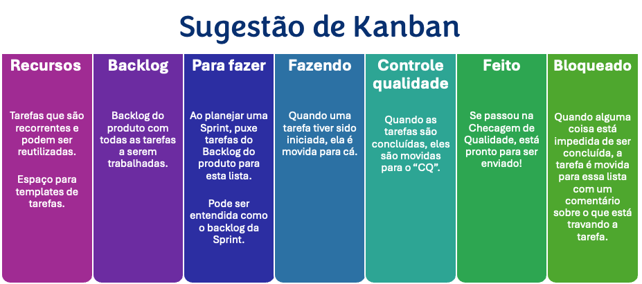

> ⚠️ **APAGUE ESSA PARTE ANTES DE ENTREGAR SEU TRABALHO**
>
> Nesta parte do documento, você deve apresentar  o processo de trabalho baseado nas metodologias ágeis, a divisão de papéis e tarefas, as ferramentas empregadas e como foi realizada a gestão de configuração do projeto via GitHub.
>
> Coloque detalhes sobre o processo de Design Thinking e a implementação do Framework Scrum seguido pelo grupo. O grupo poderá fazer uso de ferramentas on-line para acompanhar o andamento do projeto, a execução das tarefas e o status de desenvolvimento da solução.
>
> **Orientações**:
>
> - [Sobre Projects - GitHub Docs](https://docs.github.com/pt/issues/planning-and-tracking-with-projects/learning-about-projects/about-projects)
> - [Gestão de projetos com GitHub | balta.io](https://balta.io/blog/gestao-de-projetos-com-github)
> - [(460) GitHub Projects - YouTube](https://www.youtube.com/playlist?list=PLiO7XHcmTsldZR93nkTFmmWbCEVF_8F5H)
> - [11 Passos Essenciais para Implantar Scrum no seu Projeto](https://mindmaster.com.br/scrum-11-passos/)
> - [Scrum em 9 minutos](https://www.youtube.com/watch?v=XfvQWnRgxG0)

# Solução Implementada

Esta seção apresenta todos os detalhes da solução criada no projeto.

## Vídeo do Projeto

O vídeo a seguir traz uma apresentação do problema que a equipe está tratando e a proposta de solução. ⚠️ EXEMPLO ⚠️

[](https://www.youtube.com/embed/70gGoFyGeqQ)

> ⚠️ **APAGUE ESSA PARTE ANTES DE ENTREGAR SEU TRABALHO**
>
> O video de apresentação é voltado para que o público externo possa conhecer a solução. O formato é livre, sendo importante que seja apresentado o problema e a solução numa linguagem descomplicada e direta.
>
> Inclua um link para o vídeo do projeto.

## Funcionalidades

Esta seção apresenta as funcionalidades da solução.Info

##### Funcionalidade 1 - Cadastro de Contatos ⚠️ EXEMPLO ⚠️

Permite a inclusão, leitura, alteração e exclusão de contatos para o sistema

* **Estrutura de dados:** [Contatos](#ti_ed_contatos)
* **Instruções de acesso:**
  * Abra o site e efetue o login
  * Acesse o menu principal e escolha a opção Cadastros
  * Em seguida, escolha a opção Contatos
* **Tela da funcionalidade**:


> ⚠️ **APAGUE ESSA PARTE ANTES DE ENTREGAR SEU TRABALHO**
>
> Apresente cada uma das funcionalidades que a aplicação fornece tanto para os usuários quanto aos administradores da solução.
>
> Inclua, para cada funcionalidade, itens como: (1) titulos e descrição da funcionalidade; (2) Estrutura de dados associada; (3) o detalhe sobre as instruções de acesso e uso.

## Estruturas de Dados

Descrição das estruturas de dados utilizadas na solução com exemplos no formato JSON.Info

##### Estrutura de Dados - Psicologo 

Registro dos psicologos e alunos do sistema utilizados para login e para o perfil do sistema

```json
{
            "id": 1,
            "tipoUsuario": "psicologo",
            "nome": "Pedro",
            "sobrenome": "Cezar",
            "login": "admin",
            "senha": "123",
            "crp": "00/00000000000",
            "nascimento": "new Date()",
            "cpf": "123.456.78",
            "enderecoResidencial": {
                "logradouro": "Rua Subida",
                "tipoLogradouro": "casa",
                "cep": "12.123.456"
            },
            "contato": {
                "email": "psicologo1@gmail.com",
                "telefone": "91234-1234",
                "instagran": "@pedrocezar",
                "linkedin": "@pedrocezar"
            },
            "perfil": {
                "visitasPerfilMes": 32,
                "conexoes": 4,
                "solicitacoes": 2,
                "biografia": "",
                "horarioAtivo": "08:00-17:00"
            },
            "statusCasos": {
                "resolvidos": 3,
                "encaminhados": 2,
                "andamento": 1
            },
            "pacientesId": [
                3,
                5
            ],
            "consultasId": [
                1,
                2
            ],
            "id_especializacao": 1
}
  
```

##### Estrutura de Dados - Paciente

Registro dos pacientes do sistema utilizados para login e para o perfil do sistema

```json
        {
            "id": 3,
            "tipoUsuario": "paciente",
            "nome": "Arthur",
            "sobrenome": "Moreira",
            "login": "Arthur",
            "senha": "12345",
            "nascimento": "new Date()",
            "cpf": "123.456.78",
            "mesPsicologoId": {
                "1": "Janeiro"
            },
            "enderecoResidencial": {
                "logradouro": "Rua Descida",
                "tipoLogradouro": "apartamento",
                "cep": "12.123.456"
            },
            "contato": {
                "email": "paciente@gmail.com",
                "telefone": "91234-1234",
                "telefoneEmergencia": "91234-1234",
                "instagran": "@arth",
                "linkedin": "@arth"
            },
            "perfil": {
                "visitasPerfilMes": 32,
                "conexoes": 4,
                "solicitacoes": 2,
                "biografia": ""
            },
            "humorMes": [
                1,1,1,2,1,1,2,2,1,1,1,3,3,4,1
            ],
            "id_quadro": "1"
        }
```
##### Estrutura de Dados - Consulta

Registro das consultas do sistema utilizados para informar tanto os alunos quanto os psicologos (dashboard)

```json
        {
            "id": 1,
            "pacienteID": 3,
            "psicologoID": 1,
            "data_hora": "2024-04-24T11:00",
            "local": "Biblioteca Comunitária",
            "status": "confirmado",
            "modalidade": "presencial",
            "avaliacao": "Ótimo profissional, me ajudou muito no meu tratamento de ansiedade.",
            "duracao": 3,
            "notas": ""
        }
```

> ⚠️ **APAGUE ESSA PARTE ANTES DE ENTREGAR SEU TRABALHO**
>
> Apresente as estruturas de dados utilizadas na solução tanto para dados utilizados na essência da aplicação quanto outras estruturas que foram criadas para algum tipo de configuração
>
> Nomeie a estrutura, coloque uma descrição sucinta e apresente um exemplo em formato JSON.
>
> **Orientações:**
>
> * [JSON Introduction](https://www.w3schools.com/js/js_json_intro.asp)
> * [Trabalhando com JSON - Aprendendo desenvolvimento web | MDN](https://developer.mozilla.org/pt-BR/docs/Learn/JavaScript/Objects/JSON)

## Módulos e APIs

Esta seção apresenta os módulos e APIs utilizados na solução

**Images**:

* Unsplash - [https://unsplash.com/](https://unsplash.com/) ⚠️ EXEMPLO ⚠️

**Fonts:**

* Icons Font Face - [https://fontawesome.com/](https://fontawesome.com/) ⚠️ EXEMPLO ⚠️

**Scripts:**

* jQuery - [http://www.jquery.com/](http://www.jquery.com/) ⚠️ EXEMPLO ⚠️
* Bootstrap 4 - [http://getbootstrap.com/](http://getbootstrap.com/) ⚠️ EXEMPLO ⚠️

> ⚠️ **APAGUE ESSA PARTE ANTES DE ENTREGAR SEU TRABALHO**
>
> Apresente os módulos e APIs utilizados no desenvolvimento da solução. Inclua itens como: (1) Frameworks, bibliotecas, módulos, etc. utilizados no desenvolvimento da solução; (2) APIs utilizadas para acesso a dados, serviços, etc.

# Referências

As referências utilizadas no trabalho foram:

* SOBRENOME, Nome do autor. Título da obra. 8. ed. Cidade: Editora, 2000. 287 p ⚠️ EXEMPLO ⚠️

> ⚠️ **APAGUE ESSA PARTE ANTES DE ENTREGAR SEU TRABALHO**
>
> Inclua todas as referências (livros, artigos, sites, etc) utilizados no desenvolvimento do trabalho.
>
> **Orientações**:
>
> - [Formato ABNT](https://www.normastecnicas.com/abnt/trabalhos-academicos/referencias/)
> - [Referências Bibliográficas da ABNT](https://comunidade.rockcontent.com/referencia-bibliografica-abnt/)
